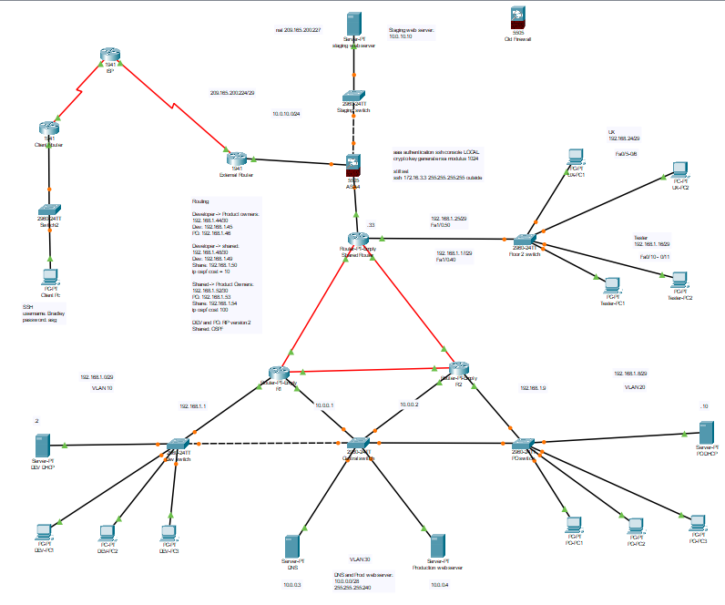
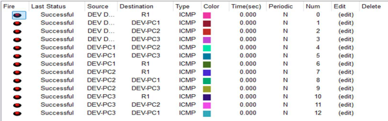
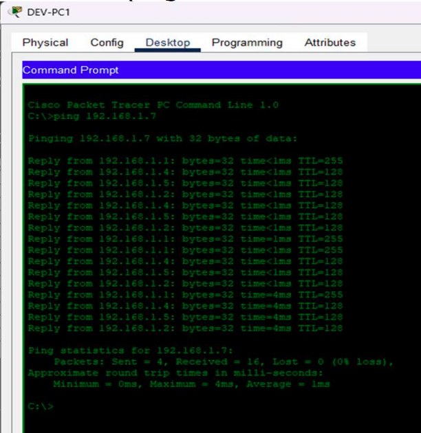
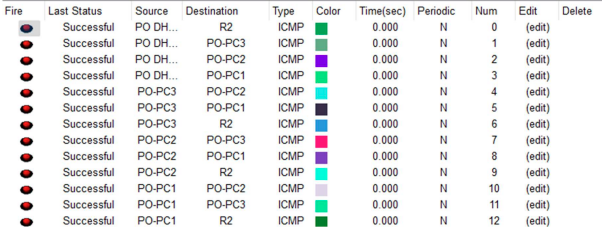
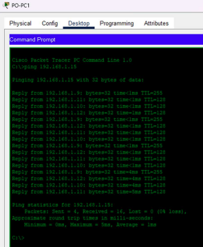
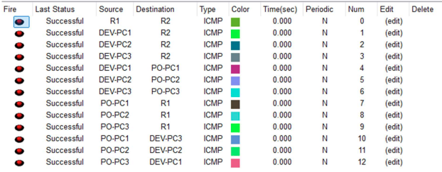
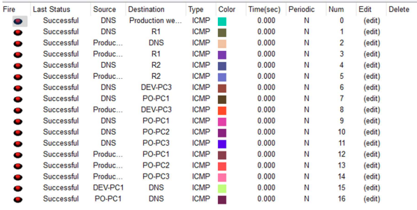
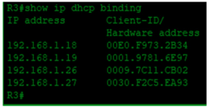
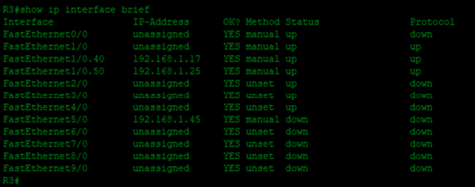

# Bugs Network

<!-- Badges -->
[](LICENSE)
[]()
[]()


[](https://github.com/kxngHADES)

## Project summary
A concise documentation of the "Bugs network" topology and configuration for a multi-floor office environment. This README explains the topology, VLAN and subnet allocations, DHCP/DNS setup, routing (RIP/OSPF), ACLs, NAT/DMZ considerations, and contains references used during the lab and deployment.


## Authors
- **Ndaedzo Mudau** — [](https://github.com/kxngHADES)  [](https://linkedin.com/in/rudzani-mudau/)


- **Mandihlume Lesedi Bakubaki** — [](https://github.com/Mandii-lesedi) • [](https://www.linkedin.com/in/mandihlume-lesedi-bakubaku-863a62319/)
<!--- **Teammate Name** — [](https://github.com/USERNAME) • [](https://www.linkedin.com/in/TEAMPERSON/)
-->


## License
This project is licensed under CC-BY-NC 4.0. See the LICENSE file for details.

## Table of contents
- [Topology](#topology)
- [Floor 1 — DEV / PO / Servers](#floor-1--dev--po--servers)
- [Floor 2 — Shared router, Tester, UX](#floor-2--shared-router-tester-ux)
- [Floor 3 — DMZ / Staging / Firewall](#floor-3--dmz--staging--firewall)
- [Routing & Protocols](#routing)
- [ACLs, NAT and SSH notes](#acls-nat-and-ssh-notes)
- [References](#references)

## Topology


## Floor 1 — DEV / PO / Servers
The floor uses a hybrid topology (star for departmental segments, mesh for inter-switch links) with VLAN segmentation to isolate traffic and provide redundancy. Switches interconnect via a mesh and VLANs control broadcast domains and gateways.

### Development Team (VLAN 10)
- Network: 192.168.1.0/29 (255.255.255.248)
- Router (R1): 192.168.1.1
- DHCP: 192.168.1.2 (pool start: 192.168.1.3)
- DNS: 10.0.0.3
- Hosts: 3 end-users
- Notes: DHCP and router addresses are static

Quick tests / diagnostics
- PDU test image: 
- Broadcast ping image: 

### Product Owners (VLAN 20)
- Network: 192.168.1.8/29 (255.255.255.248)
- Router (R2): 192.168.1.9
- DHCP: 192.168.1.10 (pool start: 192.168.1.11)
- DNS: 10.0.0.3
- Hosts: 3 end-users

Diagnostics and connectivity
- PO PDU: 
- PO broadcast test: 
- PO → DEV PDU: 

### Servers on Floor 1 (VLAN 30)
- Network: 10.0.0.0/28 (255.255.255.240)
- R1: 10.0.0.1
- R2: 10.0.0.2
- DNS: 10.0.0.3
- Prod web server: 10.0.0.4
- Routing: RIP v2 is configured between R1 and R2 for 192.168.1.0 and 10.0.0.0 networks

Connectivity verification
- Floor 1 servers reachability: 

## Floor 2 — Shared router, Tester, UX
Floor 2 uses a star topology with a shared router providing DHCP for VLANs via sub-interfaces (e.g. Fa1/0.40, Fa1/0.50).

Devices:
- Switch
- 4 end users (2 Tester, 2 UX)
- Shared router (ROAS) configured as DHCP server for VLANs 40 and 50

### Tester (VLAN 40)
- Network: 192.168.1.16/29
- Router: 192.168.1.17
- Sub-interface example: Fa1/0.40

### UX (VLAN 50)
- Network: 192.168.1.24/29
- Router: 192.168.1.25
- Sub-interface example: Fa1/0.50

Images
- Router DHCP screenshot: 
- Router interfaces screenshot: 

### ACLs (floor 2)
- Deny traffic from Tester VLAN → UX VLAN
- Deny traffic from UX VLAN → Tester VLAN
- Allow all other traffic
- Apply extended ACL (e.g. ACL 100) on incoming interface as required

## Floor 3 — DMZ / Staging / Firewall
Floor 3 operates as a DMZ behind a firewall (outside / DMZ / inside contexts). The staging web server was moved to a dedicated address space to simplify firewall/NAT configuration.

### SSH / Access notes (current)
```
SSH
username: Bradley
password: asg
aaa authentication ssh console LOCAL
crypto key generate rsa modulus 1024
ssh 172.16.3.3 255.255.255.255 outside
```

### Staging and DMZ
- Staging server initially used 192.168.1.32/30 but was moved to 10.0.10.0/24
- Firewall gateway: 10.0.10.1
- Static NAT is used to present a public IP to the staging host
- Firewall rules restrict traffic into DMZ: only allow HTTP (80) and HTTPS (443) from authorized external IPs and specific internal subnets (e.g., development)

Operational commands & verification
- Use `show xlate` to inspect NAT translations
- Use `no forward-port interface` (or equivalent firewall command) to prevent lateral movement from internal VLANs into the DMZ
- Regular monitoring (e.g., Wireshark) is recommended for audits and troubleshooting

## Routing
Inter-router links and point-to-point segments:
- Dev ↔ PO: 192.168.1.44/30 (Dev: .45, PO: .46)
- Dev ↔ Shared: 192.168.1.48/30 (Dev: .49, Shared: .50)
- Shared ↔ PO: 192.168.1.52/30 (PO: .53, Shared: .54)

Routing protocols and redistribution
- R1 ↔ R2: RIP v2 for the 192.168.1.0 and 10.0.0.0 networks
- R3 (Shared): OSPF used; redistribution with RIP configured to ensure full reachability
- Path preferences tuned by OSPF cost and static floating routes as failover

Example floating static routes
- ip route 192.168.1.44 255.255.255.252 192.168.1.49 200
- ip route 192.168.1.52 255.255.255.252 192.168.1.54 200

Notes on convergence and design
- RIP: slower convergence (periodic updates), hop-count metric, limited to 15 hops
- OSPF: faster convergence with LSAs, uses cost metric
- When redistributing, carefully control route maps/filters and metric translation to avoid loops and bloat

Best practices suggested
- Use route filtering/route-maps when redistributing between protocols
- Monitor routing tables and path selection for anomalies
- Implement periodic audits and monitoring on firewall and NAT translations


## References

- Jeremy's IT Lab, 2022. Free CCNA | SSH | Day 42 | CCNA 200-301 Complete Course. Available: https://www.youtube.com/watch?v=AvgYqI2qSD4&list=PLxbwE86jKRgMpuZuLBivzlM8s2Dk5lXBQ&index=86
- Jeremy's IT Lab, 2020. Free CCNA | VLANs (Part 1) | Day 16 | CCNA 200-301 Complete Course. Available: https://www.youtube.com/watch?v=cjFzOnm6u1g&list=PLxbwE86jKRgMpuZuLBivzlM8s2Dk5lXBQ&index=30
- Jeremy's IT Lab, 2020. Free CCNA | VLANs (Part 1) | Day 16 Lab | CCNA 200-301 Complete Course. Available: https://www.youtube.com/watch?v=-tq7f3xtyLQ&list=PLxbwE86jKRgMpuZuLBivzlM8s2Dk5lXBQ&index=31
- Jeremy's IT Lab, 2020. Free CCNA | VLANs (Part 2) | Day 17 Lab | CCNA 200-301 Complete Course. Available: https://www.youtube.com/watch?v=iRkFE_lpYgc&list=PLxbwE86jKRgMpuZuLBivzlM8s2Dk5lXBQ&index=33
- Jeremy's IT Lab, 2020. Free CCNA | Subnetting (VLSM) | Day 15 Lab | CCNA 200-301 Complete Course. Available: https://www.youtube.com/watch?v=Rn_E1Qv8--I&list=PLxbwE86jKRgMpuZuLBivzlM8s2Dk5lXBQ&index=29
- Jeremy's IT Lab, 2021. Free CCNA | DHCP | Day 39 | CCNA 200-301 Complete Course. Available: https://www.youtube.com/watch?v=hzkleGAC2_Y&list=PLxbwE86jKRgMpuZuLBivzlM8s2Dk5lXBQ&index=80
- Jeremy's IT Lab, 2021. Free CCNA | DHCP | Day 39 Lab | CCNA 200-301 Complete Course. Available: https://www.youtube.com/watch?v=cgMsoIQB9Wk&list=PLxbwE86jKRgMpuZuLBivzlM8s2Dk5lXBQ&index=81
- Jeremy's IT Lab, 2021. Free CCNA | DNS | Day 38 Lab | CCNA 200-301 Complete Course. Available: https://www.youtube.com/watch?v=7D_FapNrRUM&list=PLxbwE86jKRgMpuZuLBivzlM8s2Dk5lXBQ&index=79
- Jeremy's IT Lab, 2021. Free CCNA | Extended ACLs | Day 35 | CCNA 200-301 Complete Course. Available: https://www.youtube.com/watch?v=dUttKY_CNXE&list=PLxbwE86jKRgMpuZuLBivzlM8s2Dk5lXBQ&index=72
- Jeremy's IT Lab, 2022. Free CCNA | SSH | Day 42 Lab | CCNA 200-301 Complete Course. Available: https://www.youtube.com/watch?v=QnHq7iCOtTc&list=PLxbwE86jKRgMpuZuLBivzlM8s2Dk5lXBQ&index=87
- Jeremy's IT Lab, 2022. Free CCNA | Static NAT | Day 44 Lab | CCNA 200-301 Complete Course. Available: https://www.youtube.com/watch?v=vir6n_NVZFw&list=PLxbwE86jKRgMpuZuLBivzlM8s2Dk5lXBQ&index=91
- Lab, J. I., 2020. Free CCNA | Subnetting (Part 1) | Day 13 | CCNA 200-301 Complete Course. Available: https://www.youtube.com/watch?v=bQ8sdpGQu8c&list=PLxbwE86jKRgMpuZuLBivzlM8s2Dk5lXBQ&index=26
- Lab, J. I., 2020. Free CCNA | Subnetting (Part 2) | Day 14 | CCNA 200-301 Complete Course. Available: https://www.youtube.com/watch?v=IGhd-0di0Qo&list=PLxbwE86jKRgMpuZuLBivzlM8s2Dk5lXBQ&index=27
- Lab, J. I., 2020. Free CCNA | Subnetting (Part 3 - VLSM) | Day 15 | CCNA 200-301 Complete Course. Available: https://www.youtube.com/watch?v=z-JqCedc9EI&list=PLxbwE86jKRgMpuZuLBivzlM8s2Dk5lXBQ&index=28
- Lab, J. I., 2021. Free CCNA | Configuring OSPF (1) | Day 26 Lab | CCNA 200-301 Complete Course. Available: https://www.youtube.com/watch?v=LeLRWjfylcs
- Lab, J. I., 2021. Free CCNA | OSPF Part 1 | Day 26 | CCNA 200-301 Complete Course. Available: https://www.youtube.com/watch?v=pvuaoJ9YzoI
- South, G., 2020. Access Control Lists Part One. Available: https://youtu.be/xgC-my5L45s
- South, G., 2020. Configuring an ASA Firewall on Cisco Packet Tracer - Part THREE. Available: https://www.youtube.com/watch?v=IQI-Rv8cmYM&list=PLK-Bs6BGQBEP4HUmB1g27aIL4EPyXeLNx&index=3
- South, G., 2020. Youtube playlist OSPF. Available: https://www.youtube.com/playlist?list=PLK-Bs6BGQBEOJ73I5EPYIpozo-0vAvS_r
- South, G., 2021. Access Control Lists Part Two. Available: https://youtu.be/NYeg-nXut0Y
- South, G., 2021. Configuration of DHCP on an ASA Firewall - Part FOUR. Available: https://www.youtube.com/watch?v=pBW1X6r5kNM&list=PLK-Bs6BGQBEP4HUmB1g27aIL4EPyXeLNx&index=5
- Networkforyou, 2023. Cisco OSPF Cost Metric | How OSPF Calculates its Cost Metric | CCNA. Available: https://youtu.be/tsH7uvnSjxA
- Orhan Ergun, 2023. Note on convergence and routing differences.

